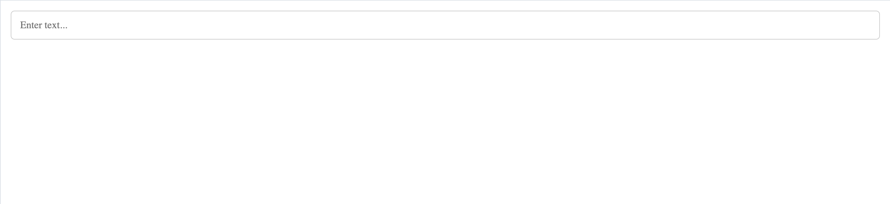
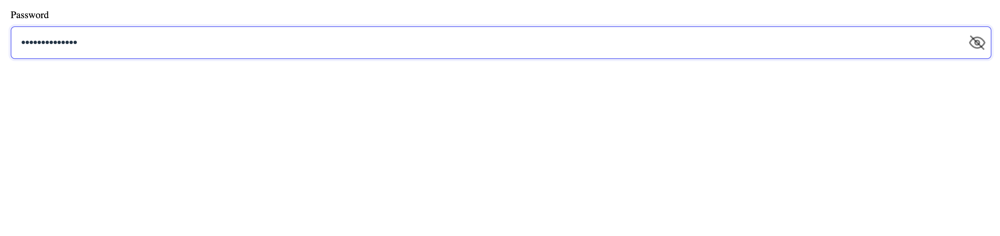
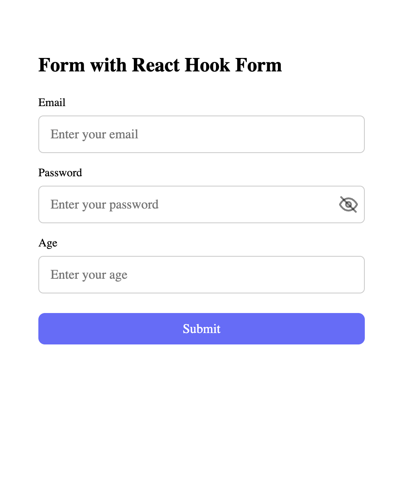
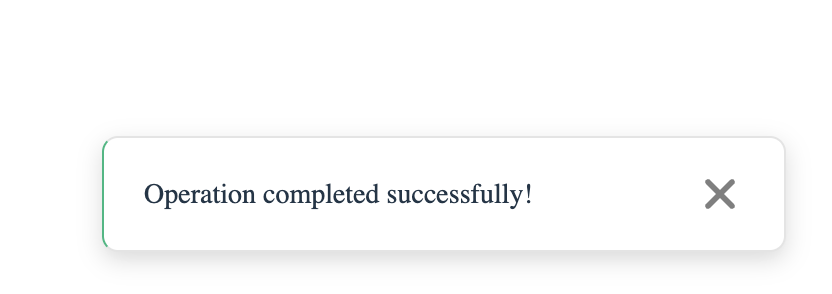
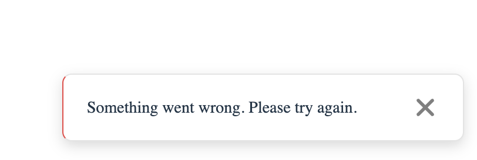
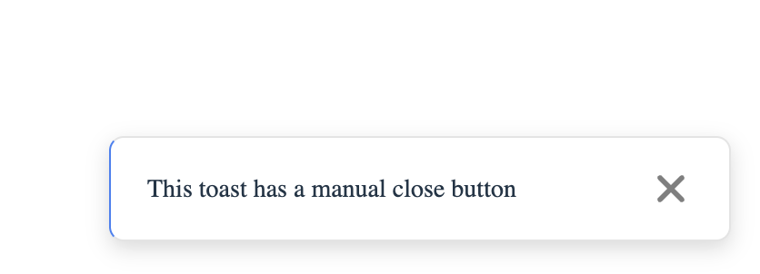
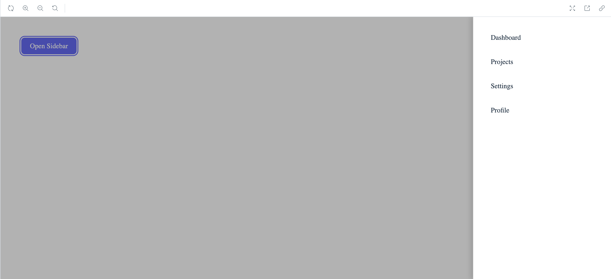
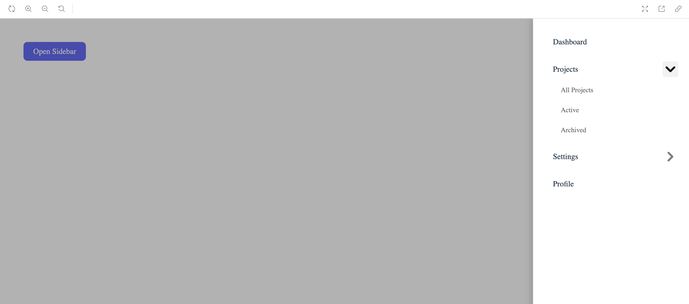

# Develops Today Test Task

React component library with TypeScript, built on Vite and Storybook.

## Setup Instructions

### Prerequisites

- Node.js (version 18 or higher)
- npm or yarn

### Installation

1. Clone the repository or download the project

2. Install dependencies:

```bash
npm install
```

### Development

Run the project in development mode:

```bash
npm run dev
```

The project will be available at `http://localhost:5173`

### Storybook

Run Storybook to view and test components:

```bash
npm run storybook
```

Storybook will be available at `http://localhost:6006`

### Build

Create a production build:

```bash
npm run build
```

### Linting

Check the code for errors:

```bash
npm run lint
```

## Component Overview

### Input

Universal input field component with support for various types and features.

**Location:** `src/components/Input/Input.tsx`

**Props:**

- `type?: "text" | "password" | "number"` - Input field type
- `value: string` - Field value (required)
- `onChange: (value: string) => void` - Value change handler (required)
- `placeholder?: string` - Placeholder text
- `label?: string` - Field label
- `clearable?: boolean` - Show clear button
- `errorMessage?: string` - Error message
- `disabled?: boolean` - Disable field
- `className?: string` - Additional CSS classes

**Features:**

- Support for types: text, password, number
- Automatic error removal for minimum length (8 characters) when sufficient characters are entered
- Validation for number type (digits only)
- Password visibility toggle button (eye icon)
- Clear button (X icon) for clearable fields
- Basic styling with light/dark theme support

**Storybook Stories:**

- Default - basic text input
- Password - password input with visibility toggle
- Number - number input
- Clearable - text input with clear button
- PasswordWithClearable - password input with clear button
- WithReactHookForm - form with React Hook Form integration

---

### Toast

Component for displaying messages to users.

**Location:** `src/components/Toast/Toast.tsx`

**Props:**

- `type: "success" | "error" | "info"` - Message type (required)
- `message: string` - Message text (required)
- `show: boolean` - Show/hide Toast (required)
- `duration?: number` - Display duration in milliseconds (default 3000ms)
- `onClose?: () => void` - Close handler

**Features:**

- Positioning at bottom-right of the screen
- Automatic dismissal after specified duration (if `onClose` is not provided)
- Manual close via "X" button (if `onClose` is provided)
- Fade/slide transitions
- Support for multi-line messages
- Basic styling with light/dark theme support

**Storybook Stories:**

- Success - success toast
- Error - error toast
- Info - informational toast
- ShortDuration - toast with short duration (1s)
- LongDuration - toast with long duration (5s)
- WithManualClose - toast with manual close button

---

### SidebarMenu

Sidebar menu with support for nested items.

**Location:** `src/components/SidebarMenu/SidebarMenu.tsx`

**Props:**

- `isOpen: boolean` - Menu open/closed state (required)
- `onClose: () => void` - Close handler (required)
- `items: MenuItem[]` - Menu items array (required)

**MenuItem Type:**

```typescript
type MenuItem = {
  label: string;
  href?: string;
  children?: MenuItem[];
};
```

**Features:**

- Slide-in animation from the right
- Semi-transparent overlay, clicking it closes the menu
- Support for 1-2 levels of nested menus
- Accordion/expand behavior for nested items
- CSS transitions for smooth animations
- Basic styling with light/dark theme support
- Responsive design for mobile devices

**Storybook Stories:**

- OneLevel - single-level menu
- TwoLevel - two-level nested menu
- OpenState - sidebar in open state
- ClosedState - sidebar in closed state

---

## Screenshots

### Input Component


_Default text input_


_Password input with visibility toggle_


_Form with React Hook Form integration_

### Toast Component


_Success toast notification_


_Error toast notification_


_Toast with manual close button_

### SidebarMenu Component


_Sidebar menu in open state_


_Two-level nested menu_

---

## Project Structure

```
src/
├── components/
│   ├── Input/
│   │   ├── Input.tsx
│   │   └── Input.css
│   ├── Toast/
│   │   ├── Toast.tsx
│   │   └── Toast.css
│   └── SidebarMenu/
│       ├── SidebarMenu.tsx
│       └── SidebarMenu.css
├── stories/
│   ├── Input.stories.tsx
│   ├── Toast.stories.tsx
│   └── SidebarMenu.stories.tsx
└── ...
```

## Technologies Used

- **React 19.2.0** - UI library
- **TypeScript** - Type system
- **Vite** - Build tool
- **Storybook 8.6.14** - Component documentation and testing
- **React Hook Form** - Form management
- **ESLint** - Code linter

## Scripts

- `npm run dev` - Run project in development mode
- `npm run build` - Create production build
- `npm run preview` - Preview production build
- `npm run storybook` - Run Storybook
- `npm run build-storybook` - Create production build of Storybook
- `npm run lint` - Check code for errors
